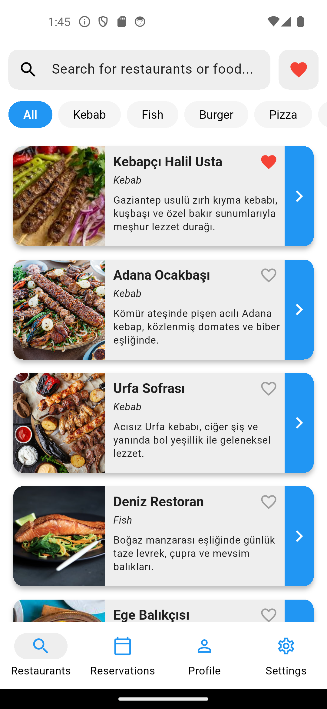
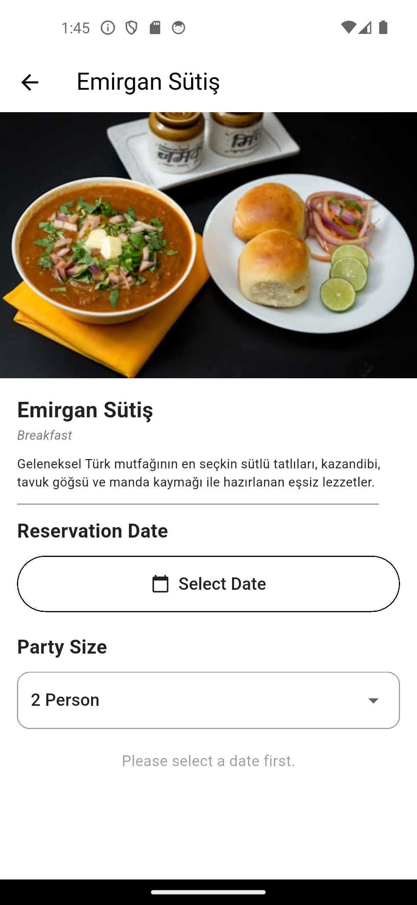
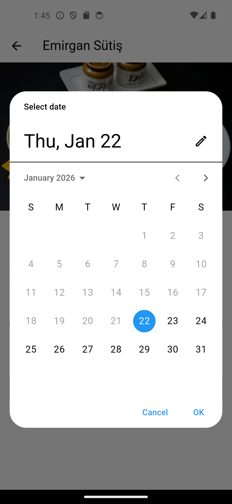
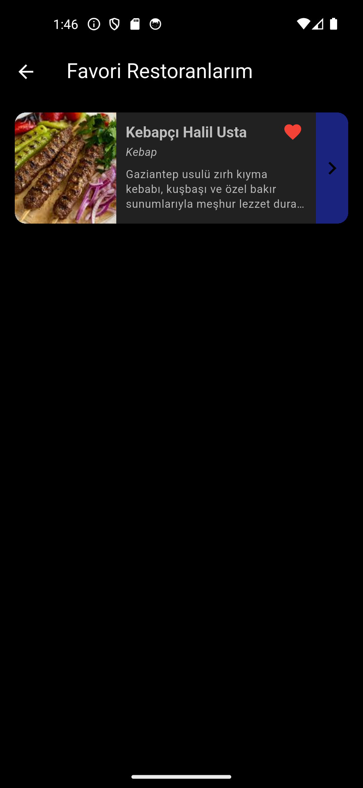
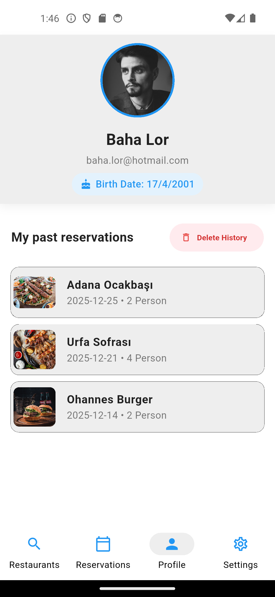
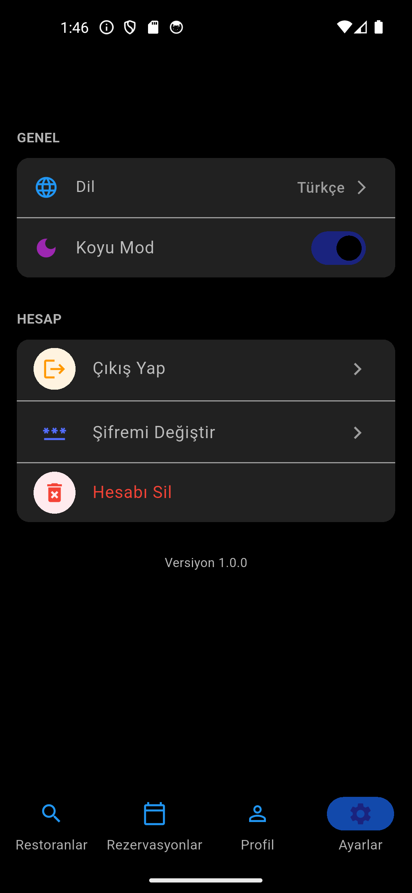
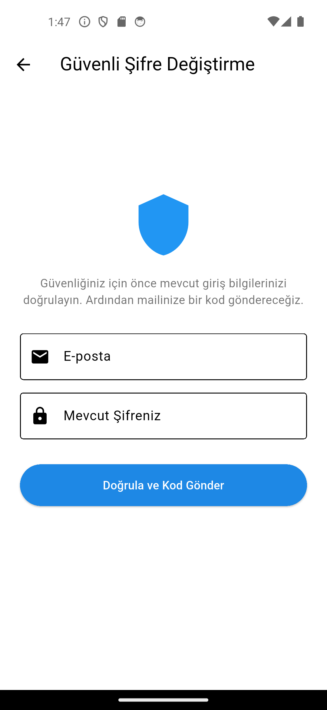

# 🍽️ Restaurant Reservation System (Full Stack)

A production-ready mobile application designed to bridge the gap between culinary discovery and seamless table management. This project demonstrates a complete **Full Stack** architecture, integrating a **Flutter** frontend with a robust **Node.js** backend and an **MSSQL** relational database.


---

## 📖 About the Project

This application was built to simulate a real-world restaurant booking platform. It solves the problem of finding available dining slots in real-time. Unlike simple CRUD apps, this project handles complex logic such as **concurrent booking management**, **local data persistence**, and **dynamic filtering**.

### 🏗️ Architecture & Design Decisions

The project follows a **Client-Server-Database** architecture ensuring separation of concerns:

1.  **Frontend (Mobile - Flutter):**
    * Built with **Dart**, focusing on a smooth 60fps performance.
    * **State Management:** Utilizes optimized `setState` patterns for granular UI updates, ensuring efficiency without boilerplate bloat.
    * **Networking:** Uses `Dio` for handling HTTP requests with interceptors for error handling.
    * **Persistence:** Implements `SharedPreferences` to cache user favorites locally, allowing the app to remember preferences even after restarting.
    * **Localization:** Features a complete dual-language system (Turkish/English) using `Intl`, making the app scalable for international markets.

2.  **Backend (API - Node.js & Express):**
    * Acts as the middleware between the mobile app and the database.
    * Exposes RESTful endpoints for authentication (`/auth`), restaurant data (`/restaurants`), and booking logic (`/book`).
    * Handles business logic such as calculating available time slots based on existing reservations.

3.  **Database (Microsoft SQL Server):**
    * A relational database structure designed with normalization in mind.
    * Tables include `Users`, `Restaurants`, `Reservations`, and `AvailabilitySlots`, linked via Foreign Keys to maintain data integrity.

---

## ✨ Key Features

* **🔐 Secure Authentication:** Full Login/Register flow with password hashing and session management.
* **🔍 Smart Search (Debounce):** The search bar waits for the user to stop typing before making API calls, reducing server load and improving UX.
* **📅 Real-Time Availability:** When a user selects a date, the backend calculates and returns only the truly available time slots, preventing double-booking.
* **❤️ Persistent Favorites:** Users can "heart" restaurants. This data is instantly saved to the device's local storage and synced with the user's profile.
* **🌍 Multi-Language Support:** The app automatically detects or allows manual switching between **English** and **Turkish**, translating all labels, buttons, and messages dynamically.
* **🌙 Dark/Light Mode:** A fully adaptive UI that respects system preferences or user choice.

---

## 📸 Screenshots

### ✨ Core Application Flow
Here is the main user journey from login to making a reservation and checking the profile.

| Login Screen | Home & Discovery | Restaurant View |
|:---:|:---:|:---:|
|  |  |  |
| **Date Selection** | **Favorites** | **User Profile** |
|  |  |  |

<br>

<details>
<summary><b>🔻 Click here to see MORE screenshots (Settings, Dark Mode, etc.)</b></summary>
<br>
These features demonstrate the depth of the application, including filtering, settings, and theming.

| Category Filter | Reservation Details | Settings Menu |
|:---:|:---:|:---:|
|  |  |  |
| **Dark Mode** | **Language Selection** | **Change Password** |
|  |  |  |

</details>

## 🚀 Installation & Setup

This project is organized as a monorepo. Follow the steps below to run it locally.

### 1. Database Setup
1.  Open **SQL Server Management Studio (SSMS)**.
2.  Navigate to the `/database` folder in this repo.
3.  Run the `script.sql` (or `kurulum.sql`) file to generate the schema and populate dummy data.

### 2. Backend Setup
```bash
cd backend
npm install
# Configure your database connection in the server file or .env
node server.js
```
### 2. Frontend Setup
```bash
cd frontend
flutter pub get
flutter run
```
